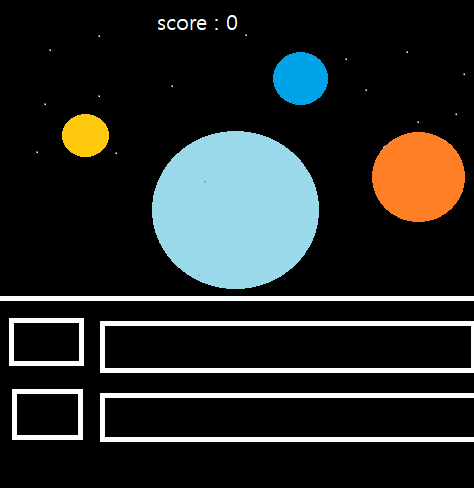
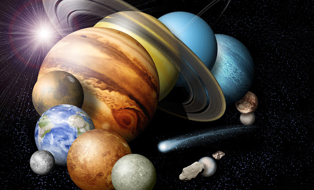
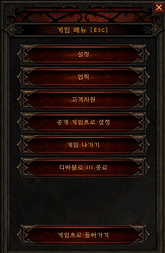
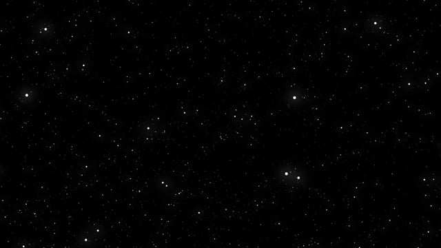

# [컨셉]
## 메인컨셉
행성 문명을 발전시키고 키우는 게임
### 서브컨셉 1 : 간편한 조작
복잡한 조작감으로 인하여 게임을 접근하기 어려워하는 유저들에게도 편한 마우스를 주로 이용함
### 서브컨셉 2 : 전략
어떻게 하면 자원을 효율적으로 사용하고, 발전을 시켜나갈지 생각하고, 각자 자기만의 전략을 사용해야함
### 서브컨셉 3 : 랭킹 시스템
유저들간에 경쟁 의식을 키울수 있게 랭크 시스템 도입
### 서브컨셉 4 : 발전
행성 문명을 발전 시키면서 만족감을 느낄 수 있게 함
### 서브컨셉 5 : 전쟁
행성을 발전 시키고, 다른 행성들과 전쟁을 벌임

  
# [관련 이미지 & 동영상]
- 이미지  

- 동영상

  
# [대표 이미지]

  

  
# [<게임제목> 구성 요소]

- 가나다라마바사아차카타파하 가나다라마바사아차카타파하

 

## 1. 메커니즘

[도전 과제]
1) 다른 행성들보다 더 많이 발전하라
2) 행성들과 경쟁하여 전쟁에서 승리하라

[재미 요소]
1) 간단한 조작감으로 즐길 수 있다.
2) 자기만의 전략으로 이끌어 갈 수 있다.

 

## 2. 이야기

[만들게 된 배경]  
어렸을때부터 전략 시뮬레이션 게임을 좋아하였는데 스타크래프트 같은 게임들은 어려워서 접하기 어려워하는 사람들을 위해 생각하게 되었다.

[카메라 관점]  
쿼터뷰 시점

 

## 3. 미적요소

[디자인][컬러]  
가나다라마바사아차카타파하 가나다라마바사아차카타파하

[음향]  
가나다라마바사아차카타파하 가나다라마바사아차카타파하
	
 

## 4. 기술  
가나다라마바사아차카타파하 가나다라마바사아차카타파하

 

## 게임 오브젝트 분해
### 1.오브젝트 이름: 행성(플레이어)

### 2.오브젝트 이름: 메뉴

### 3.오브젝트 이름: 배경

### 4.오브젝트 이름: 점수판

