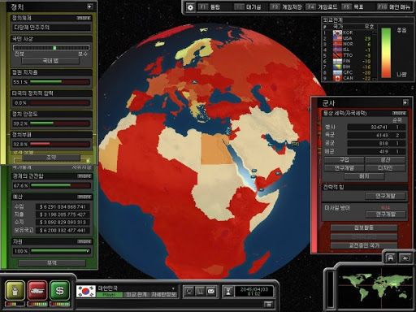

# [컨셉]
## 메인컨셉
행성 문명을 발전시키고 키우는 게임
### 서브컨셉 1 : 간편한 조작
복잡한 조작감으로 인하여 게임을 접근하기 어려워하는 유저들에게도 편한 마우스를 주로 이용함
### 서브컨셉 2 : 전략
어떻게 하면 자원을 효율적으로 사용하고, 발전을 시켜나갈지 생각하고, 각자 자기만의 전략을 사용해야함
### 서브컨셉 3 : 랭킹 시스템
유저들간에 경쟁 의식을 키울수 있게 랭크 시스템 도입
### 서브컨셉 4 : 발전
행성 문명을 발전 시키면서 만족감을 느낄 수 있게 함
### 서브컨셉 5 : 전쟁
행성을 발전 시키고, 다른 행성들과 전쟁을 벌임

  
# [관련 이미지 & 동영상]
- 이미지  

- 동영상

  
# [대표 이미지]

  
# [컨셉 & 대표이미지 기반 작품묘사]
> ### 대표이미지 기반 :

> ### 컨셉 기반:

  
# [<게임제목> 구성 요소]

- 가나다라마바사아차카타파하 가나다라마바사아차카타파하

 

## 1. 메커니즘

[도전 과제]
1) 가나다라마바사아차카타파하
2) 가나다라마바사아차카타파하

[재미 요소]
1) 가나다라마바사아차카타파하
2) 가나다라마바사아차카타파하

 

## 2. 이야기

[만들게 된 배경]  
가나다라마바사아차카타파하 가나다라마바사아차카타파하

[카메라 관점]  
가나다라마바사아차카타파하 가나다라마바사아차카타파하

 

## 3. 미적요소

[디자인][컬러]  
가나다라마바사아차카타파하 가나다라마바사아차카타파하

[음향]  
가나다라마바사아차카타파하 가나다라마바사아차카타파하
	
 

## 4. 기술  
가나다라마바사아차카타파하 가나다라마바사아차카타파하
